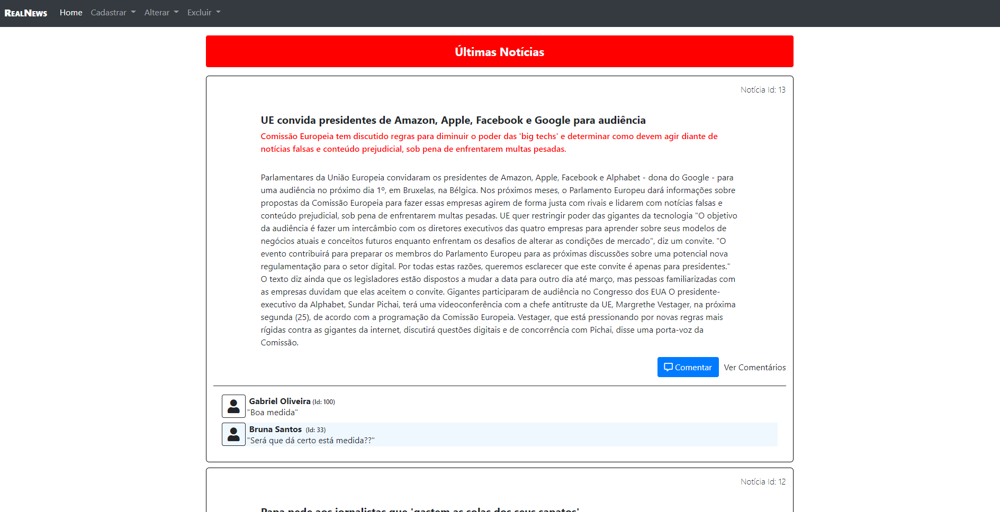

# RealNews

O Real News é um portal de notícias, mas a seguinte aplicação se trata de uma versão administrativa. 

Este é um projeto avaliativo da Faculdade que exigia o CRUD de notícias e comentários com a tecnologia aprendida no semestre(Java Web).

### Tecnologias utlizadas
- Java web (JSP, Servlet)
- Javascript
- MYSQL